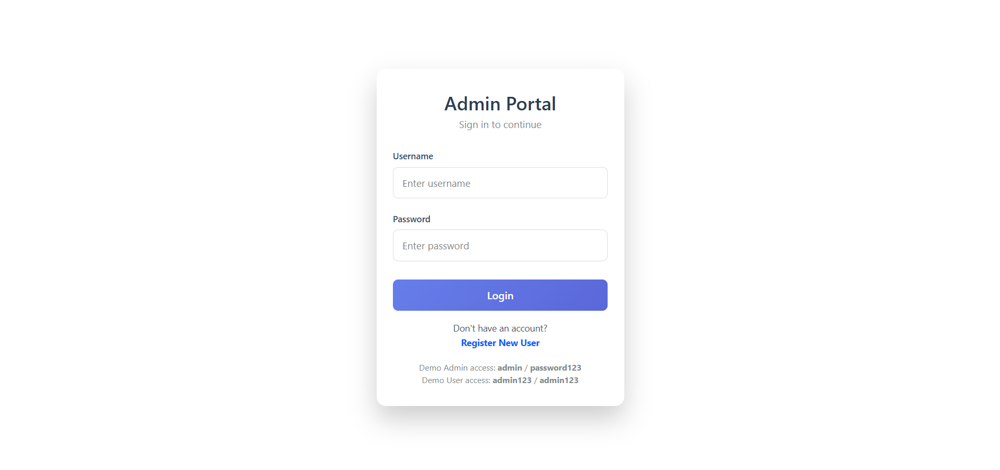
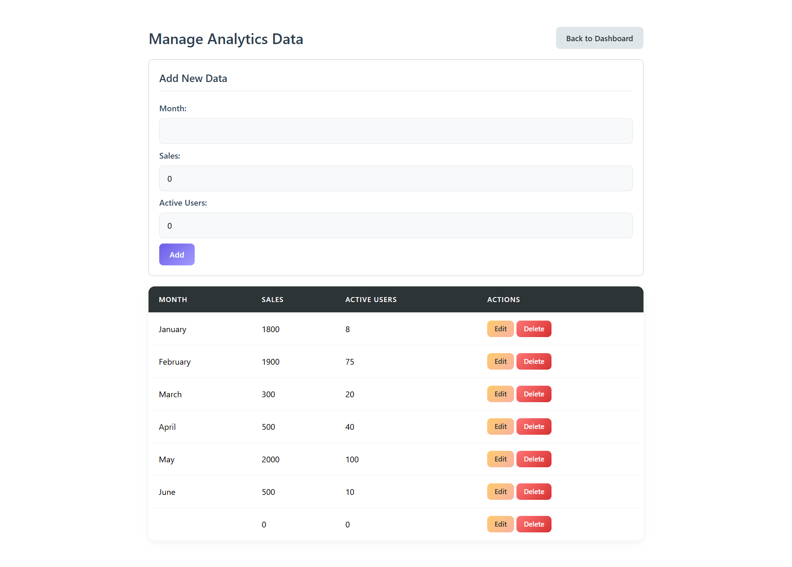

# 📊 Admin Analytics Dashboard (MEAN Stack)

A full-stack web application built using the **MEAN stack** (MongoDB, Express.js, Angular, Node.js).
This project provides secure authentication, an interactive analytics dashboard using Chart.js, and an Admin panel with full CRUD capabilities.

---

## 🟢 Project Status
**Active & Maintained**

---

## 🚀 Features

- 🔐 Secure Login & Registration
- 🧑‍💼 Role-Based Access Control (Admin/User)
- 📈 Interactive Dashboard with Chart.js
- 🛠️ Admin CRUD Management Panel
- 🔄 Real-Time Chart Updates
- 📱 Fully Responsive Design

---

## 🛠️ Tech Stack

### Frontend
- Angular (Standalone Components)
- Chart.js
- HTML5, CSS3
- Tailwind CSS

### Backend
- Node.js
- Express.js
- MongoDB (Atlas)
- Mongoose
- CORS, Body-Parser

---

## ⚙️ Installation & Setup

### Backend Setup
```bash
npm install
node server.js
```
Server runs at: http://localhost:3000

### Frontend Setup
```bash
npm install
ng serve
```
App runs at: http://localhost:4200

---

## 📡 API Endpoints

### Authentication
- POST `/api/register`
- POST `/api/login`

### Analytics (Admin Only)
- GET `/api/analytics`
- POST `/api/analytics`
- PUT `/api/analytics/:id`
- DELETE `/api/analytics/:id`

---

## 📂 Project Structure

```
│── frontend
│    └── dashboard-app
│         ├── src/
│         │    ├── app/
│         │    │   ├── admin-manage/
│         │    │   ├── dashboard/
│         │    │   ├── login/
│         │    │   ├── register/
│         │    │   └── auth.guard.ts
│         │    │── main.ts
│         │    └── server.ts
│         └── package.json    
│
│
│── backend
│    ├── models.js
│    ├── server.js
│    └── package.json
│
│
│── public-images/
│── .gitignore
└── README.md

```

---

## 🟢 Project Screenshots
**Login Page**


**Register Page**


**Admin Dashboard**


**Manage Data Analysis**
